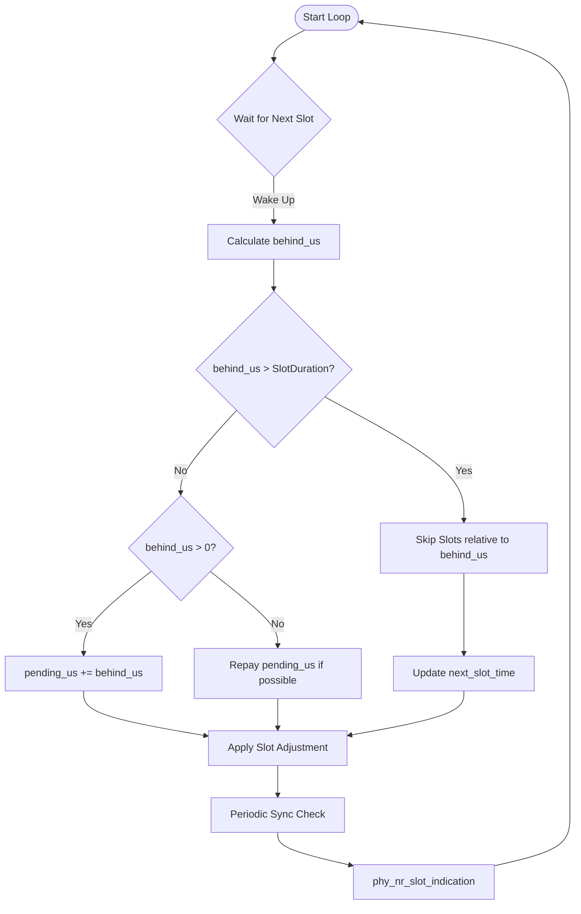
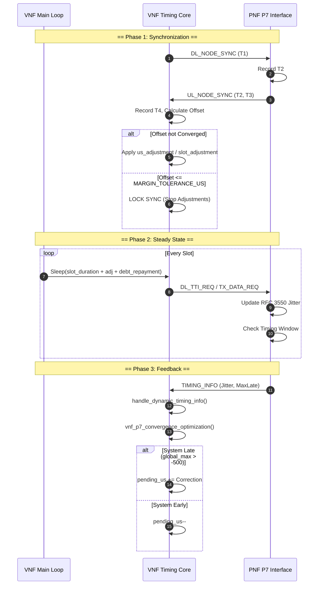

# NFAPI P7 Timing Algorithm - Code Trace Guide

This skill provides a comprehensive understanding of the thesis's NFAPI P7 timing synchronization implementation in OpenAirInterface 5G NR.

## Overview

The system implements a **Timing Feedback Adaptive Scheduler** that replaces static timing assumptions with a dynamic, adaptive control loop maintaining precise synchronization between VNF (Virtual Network Function) and PNF (Physical Network Function).

### Key Contributions

1. **VNF Autonomous Timing Loop** - Independent timing thread with slot-level control
2. **RFC 3550 Jitter Calculation** - Standardized inter-arrival jitter measurement
3. **Time Bank Mechanism** - Borrowed time repayment system
4. **Synchronization Offset Calculation** - NTP-style clock offset computation
5. **Convergence Optimization** - EWMA-based timing feedback adjustment

---

## File Structure & Absolute Paths

All paths are relative to `/home/hpe/openairinterface5g`:

### Core Files

| File | Purpose |
|------|---------|
| [nfapi_vnf.c](file:///home/hpe/openairinterface5g/nfapi/oai_integration/nfapi_vnf.c) | VNF main loop, timing thread, PHY slot indication |
| [vnf_p7.c](file:///home/hpe/openairinterface5g/nfapi/open-nFAPI/vnf/src/vnf_p7.c) | Core timing algorithms, convergence optimization |
| [vnf_p7.h](file:///home/hpe/openairinterface5g/nfapi/open-nFAPI/vnf/inc/vnf_p7.h) | Timing constants, data structures |
| [pnf_p7.c](file:///home/hpe/openairinterface5g/nfapi/open-nFAPI/pnf/src/pnf_p7.c) | PNF-side timing, jitter calculation |
| [pnf_p7.h](file:///home/hpe/openairinterface5g/nfapi/open-nFAPI/pnf/inc/pnf_p7.h) | PNF timing structures, RFC 3550 API |
| [nr-softmodem.c](file:///home/hpe/openairinterface5g/executables/nr-softmodem.c) | Mmap logger initialization |
| [gNB_scheduler.c](file:///home/hpe/openairinterface5g/openair2/LAYER2/NR_MAC_gNB/gNB_scheduler.c) | Scheduler instrumentation |

---

## Algorithm 1: VNF Autonomous Timing Loop

**Location:** [nfapi_vnf.c](file:///home/hpe/openairinterface5g/nfapi/oai_integration/nfapi_vnf.c) - Function `vnf_timing_thread()`

### Purpose
Maintains the VNF's slot heartbeat independently of PNF slot indications, handling catch-up logic for late slots and debt repayment for early slots.

### Code Trace

```c
// File: /home/hpe/openairinterface5g/nfapi/oai_integration/nfapi_vnf.c
// Function: vnf_timing_thread() - Lines ~1510-1646

void *vnf_timing_thread(void *arg) {
  vnf_p7_info *p7_vnf = (vnf_p7_info *)arg;
  vnf_p7_t *vnf_p7 = (vnf_p7_t *)p7_vnf->config;
  
  // Wait for configuration and initial timing info
  while (!p7_info->initial_timinginfo_received) {
    usleep(1000);
  }
  
  // Initialize timing parameters
  p7_info->slot_duration_us = 1000 >> p7_info->mu; // 500us for mu=1
  p7_info->sleep_baseline_us = p7_info->slot_duration_us;
  
  clock_gettime(CLOCK_MONOTONIC, &p7_info->next_slot_time);
  
  while (p7_info->running) {
    // Step 1: Calculate how far behind we are
    clock_gettime(CLOCK_MONOTONIC, &now);
    int32_t process_us = ((now.tv_sec - p7_info->next_slot_time.tv_sec) * 1000000000LL
                         + (now.tv_nsec - p7_info->next_slot_time.tv_nsec)) / 1000;
    int32_t duration_us = p7_info->us_adjustment + p7_info->slot_duration_us;
    int32_t behind_us = process_us - duration_us;
    
    if (behind_us >= (int32_t)p7_info->slot_duration_us) {
      // CASE SKIP: Far behind - skip slots to catch up
      int skip_slots = process_us / p7_info->slot_duration_us;
      sfnslot_dec = (sfnslot_dec + skip_slots + 1 + MAX_SFNSLOTDEC) % MAX_SFNSLOTDEC;
    } else if (behind_us > 0) {
      // CASE NOT ENOUGH: Slightly behind - add to pending_us (time bank)
      p7_info->pending_us += behind_us;
    } else {
      // CASE ENOUGH: Early - repay pending_us if possible
      if (p7_info->pending_us > 0 && remaining_us > 50) {
        int32_t repay_amount = min(remaining_us - 50, p7_info->pending_us);
        p7_info->pending_us -= repay_amount;
        timespec_add_us(&p7_info->next_slot_time, -repay_amount);
      }
    }
    
    // Step 2: Apply slot adjustment from sync
    if (!p7_info->sync_locked && p7_info->slot_adjustment != 0) {
      sfnslot_dec = (sfnslot_dec + p7_info->slot_adjustment + MAX_SFNSLOTDEC) % MAX_SFNSLOTDEC;
      p7_info->slot_adjustment = 0;
    }
    
    // Step 3: Update global state
    p7_info->sfn = NFAPI_SFNSLOTDEC2SFN(p7_info->mu, sfnslot_dec);
    p7_info->slot = NFAPI_SFNSLOTDEC2SLOT(p7_info->mu, sfnslot_dec);
    
    // Step 4: Periodic sync check
    if (p7_info->sync_slot_counter++ >= p7_info->sync_period_slots) {
      vnf_nr_build_send_dl_node_sync(vnf_p7, p7_info);
    }
    
    // Step 5: Send slot indication (core work)
    nfapi_nr_slot_indication_scf_t ind = {.sfn = p7_info->sfn, .slot = p7_info->slot};
    phy_nr_slot_indication(&ind);
    
    // Advance to next slot
    sfnslot_dec = (sfnslot_dec + 1) % MAX_SFNSLOTDEC;
  }
}
```

### Flow Diagram



---

## Algorithm 2: Synchronization Offset Calculation

**Location:** [vnf_p7.c](file:///home/hpe/openairinterface5g/nfapi/open-nFAPI/vnf/src/vnf_p7.c) - Function `vnf_nr_handle_ul_node_sync()`

### Purpose
Calculates clock offset between VNF and PNF using NTP-style timing, locks sync once converged.

### Formulae

$$Offset = \frac{(t_2 - t_1) - (t_4 - t_3)}{2}$$

$$OWD = \frac{(t_4 - t_1) - (t_3 - t_2)}{2}$$

### Code Trace

```c
// File: /home/hpe/openairinterface5g/nfapi/open-nFAPI/vnf/src/vnf_p7.c
// Function: vnf_nr_handle_ul_node_sync() - Lines ~1714-1743

void vnf_nr_handle_ul_node_sync(void *pRecvMsg, int recvMsgLen, vnf_p7_t* vnf_p7) {
  uint32_t now_time_hr = vnf_get_current_time_hr();
  
  nfapi_nr_ul_node_sync_t ind;
  // ... unpack message ...
  
  nfapi_vnf_p7_connection_info_t* p7_info = vnf_p7_connection_info_list_find(vnf_p7, ind.header.phy_id);
  int32_t t4 = calculate_nr_t4(now_time_hr, p7_info->mu, p7_info->sfn, p7_info->slot, vnf_p7->slot_start_time_hr);
  
  // Calculate offset using int64_t for proper handling
  // Positive offset = VNF BEHIND PNF (need to speed up)
  // Negative offset = VNF AHEAD of PNF (need to slow down)
  int32_t offset = (int32_t)( ((int64_t)ind.t2 - (int64_t)ind.t1 - ((int64_t)t4 - (int64_t)ind.t3)) / 2 );
  int32_t owd = (int32_t)( ((int64_t)t4 - (int64_t)ind.t1 - ((int64_t)ind.t3 - (int64_t)ind.t2)) / 2 );
  
  int32_t slot_us = (int32_t)p7_info->slot_duration_us;
  int32_t offsetslot = (offset + TARGET_MARGIN_INITIAL) / slot_us;
  int32_t offsetus = (offset + TARGET_MARGIN_INITIAL) % slot_us;
  
  pthread_mutex_lock(&p7_info->mutex);
  if (!p7_info->sync_locked) {
    if (offset + TARGET_MARGIN_INITIAL >= -MARGIN_TOLERANCE_US && 
        offset + TARGET_MARGIN_INITIAL <= MARGIN_TOLERANCE_US) {
      // Converged - permanently lock sync
      p7_info->sync_locked = 1;
      p7_info->us_adjustment = 0;
      p7_info->slot_adjustment = 0;
    } else {
      // Still converging - apply adjustments
      p7_info->us_adjustment = -offsetus;
      p7_info->slot_adjustment = offsetslot;
    }
  }
  pthread_mutex_unlock(&p7_info->mutex);
}
```

---

## Algorithm 3: RFC 3550 Jitter Calculation

**Location:** [pnf_p7.c](file:///home/hpe/openairinterface5g/nfapi/open-nFAPI/pnf/src/pnf_p7.c) - Function `pnf_update_jitter()`

### Purpose
Implements RFC 3550 Section 6.4.1 interarrival jitter calculation for network stability measurement.

### Formula

$$J(i) = J(i-1) + \frac{|D(i-1, i)| - J(i-1)}{16}$$

Where $D$ is the difference in transit time between consecutive packets.

### Code Trace

```c
// File: /home/hpe/openairinterface5g/nfapi/open-nFAPI/pnf/src/pnf_p7.c
// Function: pnf_update_jitter() - Lines ~2194-2275

void pnf_update_jitter(pnf_p7_t* pnf_p7, 
                       nfapi_jitter_msg_type_t msg_type,
                       uint32_t p7_tx_timestamp,
                       uint32_t recv_time_hr)
{
  // Get pointers to appropriate state based on message type
  double *jitter_us;
  uint32_t *prev_rx_time_hr;
  uint32_t *prev_tx_ts_us;
  uint8_t *jitter_init;
  
  switch (msg_type) {
    case NFAPI_JITTER_DL_TTI:
      prev_rx_time_hr = &pnf_p7->dl_tti_prev_rx_time_hr;
      prev_tx_ts_us = &pnf_p7->dl_tti_prev_tx_ts_us;
      jitter_us = &pnf_p7->dl_tti_jitter_us;
      jitter_init = &pnf_p7->dl_tti_jitter_init;
      break;
    // ... other cases for UL_TTI, UL_DCI, TX_DATA ...
  }
  
  // First packet - initialize state
  if (!(*jitter_init)) {
    *prev_rx_time_hr = recv_time_hr;
    *prev_tx_ts_us = p7_tx_timestamp;
    *jitter_us = 0.0;
    *jitter_init = 1;
    return;
  }
  
  // RFC 3550 calculation:
  // D(i) = (R(i)-R(i-1)) - (S(i)-S(i-1))
  int64_t delta_r_us = timehr_diff_us(recv_time_hr, *prev_rx_time_hr);
  int64_t delta_s_us = p7_tx_ts_diff_us(p7_tx_timestamp, *prev_tx_ts_us);
  
  // Update history
  *prev_rx_time_hr = recv_time_hr;
  *prev_tx_ts_us = p7_tx_timestamp;
  
  int64_t d = delta_r_us - delta_s_us;
  if (d < 0) d = -d;
  
  // J(i) = J(i-1) + (|D(i)| - J(i-1)) / 16
  *jitter_us += ((double)d - *jitter_us) / 16.0;
}
```

---

## Algorithm 4: PNF Timing Verification

**Location:** [pnf_p7.c](file:///home/hpe/openairinterface5g/nfapi/open-nFAPI/pnf/src/pnf_p7.c) - Function `check_nr_p7_timing()`

### Purpose
Verifies if packets arrive within the valid P7 timing window, tracks delay statistics.

### Code Trace

```c
// File: /home/hpe/openairinterface5g/nfapi/open-nFAPI/pnf/src/pnf_p7.c
// Function: check_nr_p7_timing() - Lines ~2420-2471

static bool check_nr_p7_timing(pnf_p7_t* pnf_p7, uint16_t msg_sfn, uint16_t msg_slot, 
                               const char* name, uint32_t recv_time_hr, 
                               uint32_t timing_offset, int32_t* latest_delay, 
                               int32_t* earliest_arrival)
{
  // Calculate slot difference (wrap-around handling)
  int32_t diff_slots = calc_slot_diff(pnf_p7, msg_sfn, msg_slot);
  int64_t slot_len_us = 10000 / NFAPI_SLOTNUM(pnf_p7->mu);
  
  // Calculate margin: Time remaining until deadline
  int64_t time_since_slot_start = timehr_diff_us(recv_time_hr, pnf_p7->slot_start_time_hr);
  int64_t delay_to_msg_slot = diff_slots * slot_len_us;
  int64_t margin = delay_to_msg_slot - time_since_slot_start - timing_offset;
  
  // Offset = -Margin
  // Positive: LATE, Negative: EARLY
  int64_t offset = -margin;
  
  // Update statistics
  if (offset > *latest_delay) {
    *latest_delay = (int32_t)offset;
  }
  if (offset < *earliest_arrival) {
    *earliest_arrival = (int32_t)offset;
  }
  
  // Check window bounds
  if (margin < 0 || margin > (int64_t)pnf_p7->timing_window) {
    if (pnf_p7->_public.timing_info_mode_aperiodic) {
      pnf_p7->timing_info_aperiodic_send = 1;
    }
    return false;
  }
  return true;
}
```

---

## Algorithm 5: Convergence Optimization

**Location:** [vnf_p7.c](file:///home/hpe/openairinterface5g/nfapi/open-nFAPI/vnf/src/vnf_p7.c) - Function `vnf_p7_convergence_optimization()`

### Purpose
EWMA-based timing feedback adjustment to maintain target margin.

### Code Trace

```c
// File: /home/hpe/openairinterface5g/nfapi/open-nFAPI/vnf/src/vnf_p7.c
// Function: vnf_p7_convergence_optimization() - Lines ~3191-3212

int count = 0;
int32_t global_max = INT32_MIN;

void vnf_p7_convergence_optimization(nfapi_vnf_p7_connection_info_t *p7_info, 
                                      const vnf_timing_stats_t *stats)
{
  int32_t all_late = stats->max;
  if (all_late == 0) return;
  
  // Calculate EWMA for timing stats
  if (all_late > global_max) 
    global_max = (global_max * 0.1) + (all_late * 0.9);
  else 
    global_max = (global_max * 0.9) + (all_late * 0.1);
  
  if (global_max > -500) {
    // CASE LATE
    count++;
    if (count >= 3) {
      p7_info->pending_us += (global_max + 500) * 0.1;
      count = 0;
    }
  } else {
    // CASE EARLY
    p7_info->pending_us--;
    count = 0;
  }
}
```

---

## Timing Control Constants

**Location:** [vnf_p7.h](file:///home/hpe/openairinterface5g/nfapi/open-nFAPI/vnf/inc/vnf_p7.h) - Lines ~2903-2917

| Constant | Value | Description |
|----------|-------|-------------|
| `MARGIN_TOLERANCE_US` | 200 | Deadband zone (±200μs) to prevent oscillation |
| `TARGET_MARGIN_INITIAL` | 500 | Target safety margin in microseconds |
| `TARGET_TIMING_WINDOW` | 1900 | Maximum valid window (μs) |
| `MIN_SLEEP_US` | 50 | Minimum allowable sleep time |
| `MAX_SLEEP_US` | 950 | Maximum sleep cap per slot |
| `SLOT_ARRAY_SIZE` | 20 | Circular buffer size for TDD pattern |

---

## Key Data Structures

### VNF Connection Info

**Location:** [vnf_p7.h](file:///home/hpe/openairinterface5g/nfapi/open-nFAPI/vnf/inc/vnf_p7.h) - Lines ~90-127

```c
typedef struct nfapi_vnf_p7_connection_info {
  // ... existing fields ...
  
  // Synchronization control
  int32_t slot_adjustment;        // Slot-level correction
  int32_t us_adjustment;          // Microsecond-level correction
  uint8_t sync_locked;            // Flag: offset converged, stop adjustments
  
  // Periodic sync control
  uint32_t sync_slot_counter;     // Counter for periodic sync
  uint32_t sync_period_slots;     // Period between syncs
  
  // Timing loop
  struct timespec next_slot_time; // Next slot target time
  uint32_t slot_duration_us;      // Slot duration in microseconds
  pthread_mutex_t mutex;          // Thread safety
  
  // Time Bank
  int32_t pending_us;             // Accumulated borrowed time
  
  // Timing Control
  int32_t sleep_baseline_us;      // Base sleep time
  int32_t baseline_envelope_us;   // Peak-hold envelope
  int32_t peak_envelope_us;       // Peak tracking for target
  
} nfapi_vnf_p7_connection_info_t;
```

### PNF P7 Jitter State

**Location:** [pnf_p7.h](file:///home/hpe/openairinterface5g/nfapi/open-nFAPI/pnf/inc/pnf_p7.h) - Lines ~120-200

```c
struct pnf_p7_t {
  // RFC 3550 jitter calculation state
  uint32_t dl_tti_jitter;
  uint32_t ul_tti_jitter;
  uint32_t ul_dci_jitter;
  uint32_t tx_data_jitter;
  
  // Previous timestamps for jitter calculation
  uint32_t dl_tti_prev_rx_time_hr;
  uint32_t dl_tti_prev_tx_ts_us;
  double dl_tti_jitter_us;          // Smoothed jitter estimate
  uint8_t dl_tti_jitter_init;       // Init flag
  
  // Timing statistics
  int32_t dl_tti_latest_delay;
  int32_t dl_tti_earliest_arrival;
  // ... similar for ul_tti, ul_dci, tx_data ...
  
  // Configuration from VNF
  uint32_t timing_window;
  uint32_t dl_tti_timing_offset;
  uint32_t ul_tti_timing_offset;
};
```

---

## Standard Parameters & Tables

### nFAPI Timing Info (Feedback from PNF)
This table summarizes the parameters returned by the PNF to the VNF to provide timing feedback.

```latex
\begin{table}[htbp]
\caption{nFAPI Timing Info Parameters}
\label{tab:timing_info}
\centering
\begin{tabularx}{\columnwidth}{l|l|X}
\toprule
\textbf{Field} & \textbf{Type} & \textbf{Description} \\ \midrule
Last SFN / Slot & uint16\_t & The completed SFN (0--1023) and slot (0--159) that triggered the message. \\ 
Time Since Last Info & uint32\_t & Time in ms since the last Timing Info message was sent. \\ 
Jitter & uint32\_t & Inter-message jitter ($\mu$s) for DL\_TTI, TxData, UL\_TTI, and UL\_DCI. \\ 
Latest Delay & int32\_t & Latest delay offset ($\mu$s) from acceptable window. Positive: late, negative: early. \\ 
Earliest Arrival & int32\_t & Earliest arrival offset ($\mu$s) from acceptable window. \\ 
Subcarrier Spacing & uint8\_t & SCS index (0: 15kHz to 4: 240kHz) as defined in TS38.211. \\ \bottomrule
\end{tabularx}
\end{table}
```

### nFAPI Delay Management Configuration (VNF to PNF)
This table summarizes the configuration parameters sent from the VNF to the PNF to manage the timing window.

```latex
\begin{table}[htbp]
\caption{nFAPI Delay Management Configuration Parameters}
\label{tab:delay_mgmt_config}
\centering
\begin{tabularx}{\columnwidth}{l|p{1.5cm}|X}
\toprule
\textbf{Parameter} & \textbf{Type} & \textbf{Description} \\ \midrule
timingWindow & uint16\_t & Timing window for delay management. See section 3.2.9 of [10] \\
timingMode & uint8\_t & Timing mode for Timing Info. See section 3.2.9 of [10] \\
timingPeriod & uint8\_t & Timing period for Timing Info. See section 3.2.9 of [10] \\ \bottomrule
\end{tabularx}
\end{table}
```

---

---

## Message Sequence Chart



---

## Telemetry & Debugging

### Log Files

**Initialization in:** [nr-softmodem.c](file:///home/hpe/openairinterface5g/executables/nr-softmodem.c)

| Log File | Description |
|----------|-------------|
| `logs/NR_TIMING_INFO.txt.*` | P7 timing info from PNF feedback |
| `logs/ul_node_sync.txt.*` | Synchronization offset calculation |
| `logs/margin.txt.*` | Timing margin analysis |
| `logs/nfapi_path.txt.*` | Scheduling path instrumentation |
| `logs/harq_timing.txt.*` | HARQ timing tracking |
| `logs/vnf-prb.txt.*` | PRB allocation tracking |

### Log Format

```
[timestamp.ns] SFN.SLOT message
```

Example:
```
[1706694234.123456789] 182.5 offset=0, owd=43, t(301402,301490,301625,301712) slot_adj:0 us_adj:0
```

---

## Build & Configuration

### Build Command

```bash
cd /home/hpe/openairinterface5g/cmake_targets/ran_build/build
sudo ninja nr-softmodem nr-uesoftmodem dfts ldpc params_libconfig rfsimulator
```

### Key Configuration Parameters

Set in [nfapi_vnf.c](file:///home/hpe/openairinterface5g/nfapi/oai_integration/nfapi_vnf.c) `configure_nr_nfapi_vnf()`:

```c
vnf->p7_vnfs[0].timing_window = 2200;          // P7 timing window (μs)
vnf->p7_vnfs[0].periodic_timing_enabled = 1;   // Enable periodic timing info
vnf->p7_vnfs[0].periodic_timing_period = 9;    // Period (slots)
```

---

## Related Patches

- **thesis-oai.patch**: Full implementation including mmap logger, VNF timing thread, PNF jitter calculation
- **thesis-algorithm.patch**: Algorithm documentation and README updates
