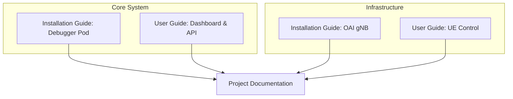
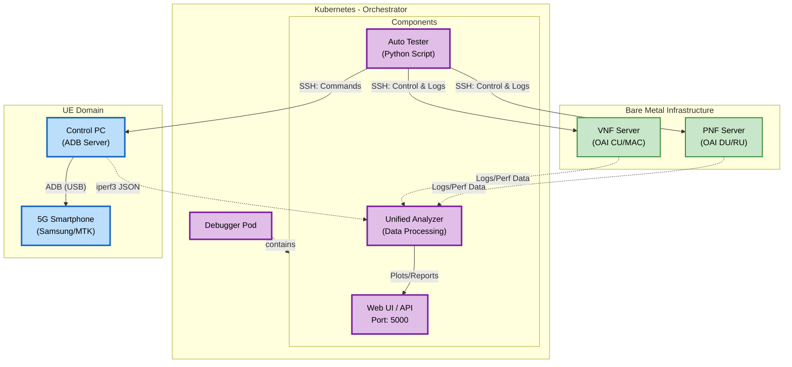
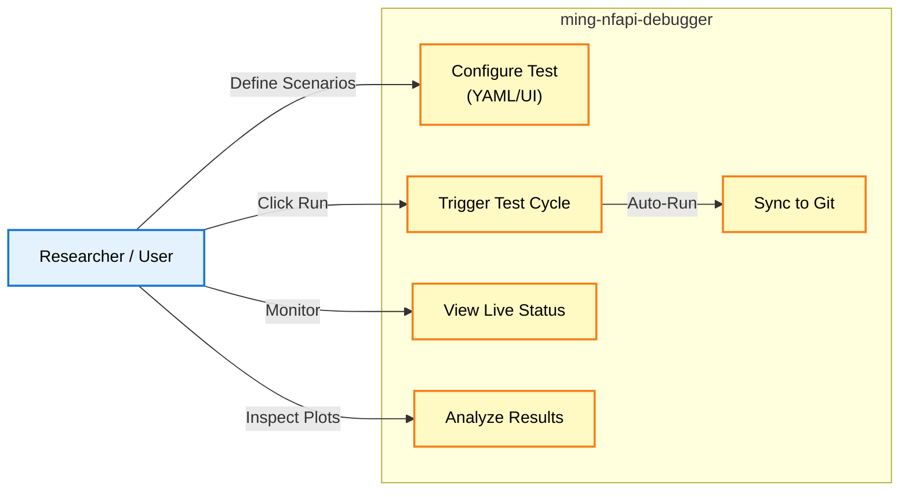
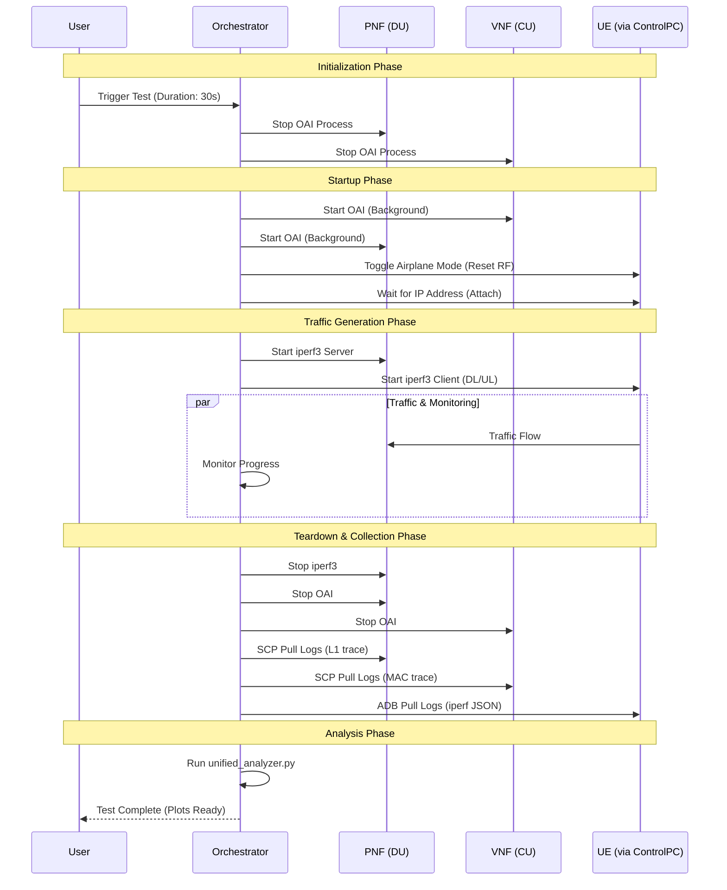
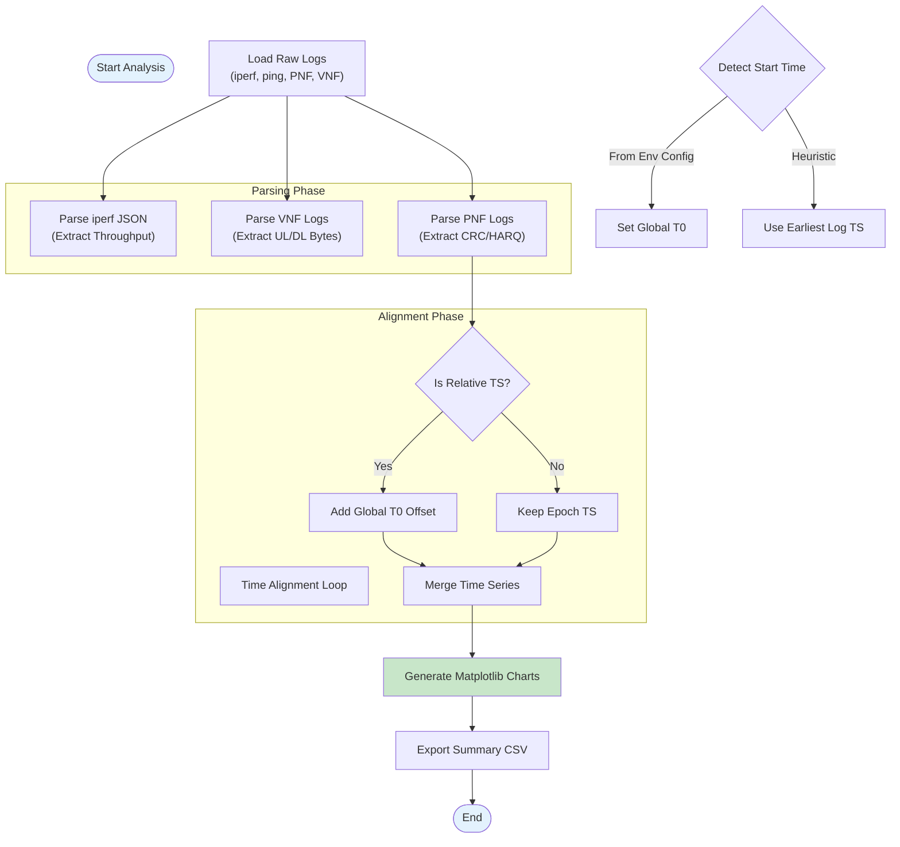
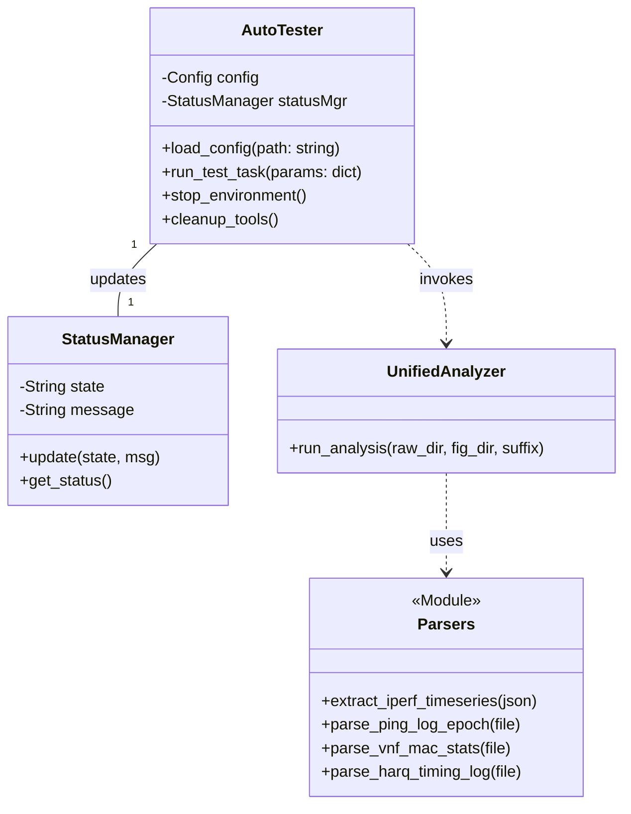

# OAI nFAPI Debugger & Auto-Tester

This project is an automated testing and debugging tool for OpenAirInterface (OAI) based 5G networks. It is designed to orchestrate test scenarios, profile performance, and collect logs across distributed components (PNF, VNF, and UE).

The tool runs as a Kubernetes service (Pod) and interacts with remote servers (PNF/VNF hosts) via SSH and a Control PC (managing the UE) via ADB/SSH.

## Key Features

- **Automated Test Orchestration**: Automatically starts/stops OAI environments and runs test sequences.
- **Traffic Generation**: Integrated `iperf3` (TCP/UDP) and `ping` tests for Downlink (DL) and Uplink (UL).
- **Performance Profiling**:
  - **CPU Profiling**: Uses `perf` to record CPU events on OAI processes (`nr-softmodem`).
  - **Flamegraphs**: Automatically generates flamegraphs to visualize CPU hotspots.
  - **CPU Efficiency Analysis**: Calculates CPU usage per Mbps.
- **AI-Powered Diagnostics (MCP)**: Implements the **Model Context Protocol** (MCP) to allow AI agents to run diagnostics and analyze network logs.
- **Log & Artifact Collection**: Fetches logs (PNF, VNF) and build artifacts (e.g., `margin.txt`, `nfapi_path.txt`) for post-analysis.
- **Git Integration**: Automatically commits and pushes test results (logs, figures) to a remote Git repository for archival.
- **Data Visualization**: Generates plots for throughput, latency, and CPU usage.
- **Modern Web UI**:
    - **Dashboard**: Browse test results and figures with a clean, responsive interface.
    - **One-Click Comparison**: Select two test datasets and trigger side-by-side comparison directly from the browser.
    - **Real-time Status**: Monitor test execution progress via the traffic light status panel.

## Architecture

Please see [doc/architecture.md](doc/architecture.md) for a detailed breakdown of the system components and workflow.

<h1 align="center">Project Documentation - ming-nfapi-debugger</h1>
---

> [!NOTE]
> **Documentation Structure:**
>
> - **Installation Guide**: System setup, configuration, and deployment procedures
> - **User Guide**: Operating instructions for the deployed system
> - **Project Documentation**: Technical architecture, use cases, MSC, flowcharts, and class diagrams with links to installation guides

**Documentation Hierarchy:**

## Table of Contents

> [!TIP]
> **Auto-Generate Table of Contents:**
> Use [Markdown All in One](https://marketplace.visualstudio.com/items?itemName=yzhang.markdown-all-in-one#table-of-contents) extension in VS Code for automatic TOC generation.

- [Table of Contents](#table-of-contents)
- [Introduction](#introduction)
- [Execution Status](#execution-status)
- [Minimum Requirements](#minimum-requirements)
- [System Architecture](#system-architecture)
  - [Software Requirements and Versions](#software-requirements-and-versions)
  - [Components Explanation](#components-explanation)
    - [Orchestrator - Debugger Pod](#orchestrator---debugger-pod)
    - [Infrastructure - OAI gNB [2024.w40]](#infrastructure---oai-gnb-2024w40)
    - [User Equipment - Control PC & Android UE](#user-equipment---control-pc--android-ue)
- [Use Case Diagram](#use-case-diagram)
- [Message Sequence Chart (MSC)](#message-sequence-chart-msc)
  - [UC1: Automated Test Cycle](#uc1-automated-test-cycle)
  - [UC2: UE Airplane Mode Toggle](#uc2-ue-airplane-mode-toggle)
- [Flowchart](#flowchart)
  - [Algorithm: Unified Analyzer Data Processing](#algorithm-unified-analyzer-data-processing)
- [Class Diagram](#class-diagram)
- [System Parameters](#system-parameters)
- [References](#references)

## Introduction

> [!NOTE]
> **Guideline:** Define the research background, problem statement, contributions, and challenges. Structure the introduction to be suitable for academic paper publication.

**Example:**

This document presents `ming-nfapi-debugger`, an automated testing, profiling, and analysis orchestration system for 5G OpenAirInterface (OAI) networks. It is designed to facilitate reproducible research and deep debugging of O-RAN components by automating the complex lifecycle of network deployment, traffic generation, and cross-layer data correlation.

1. **Background**: 
   - 5G O-RAN experimentation involves complex distributed systems (CU, DU, RU, UE) that are difficult to coordinate manually.
   - Correlating logs from different network layers (PHY, MAC, RLC, Application) with traffic performance (throughput, latency) is error-prone and time-consuming.

2. **Importance**: 
   - Accelerates development cycles by 10x through fully automated regression testing.
   - Provides deep observability into millisecond-level PHY/MAC layer events (HARQ, Timing, Scheduling) correlated with application KPIs.

3. **Contribution**: 
   - A Kubernetes-native orchestration pod that manages external bare-metal OAI servers via SSH/SCP.
   - A unified analysis engine that aligns asynchronous logs from distributed nodes into a coherent time-series dataset.
   - Automated profiling integration (`perf`, Flamegraphs) for performance bottleneck detection.

4. **Challenges**: 
   - **Time Synchronization**: Aligning logs from independent clocks on UE, PNF, and VNF with microsecond precision for accurate latency analysis.
   - **System Stability**: Handling RF instability and process crashes typically found in experimental SDR-based networks.

## Execution Status

**Guideline:** Track implementation progress with a status table.

| Step                                                                  | Status | Timeline   | Execution Status / Notes                                |
| --------------------------------------------------------------------- | ------ | ---------- | ------------------------------------------------------- |
| [Deploy Debugger Pod](#installation-guide-link)                       | ✅     | 2026-01-08 | Initial Flask App & Auto-Tester deployment              |
| [Connect to OAI PNF/VNF](#infrastructure-setup)                       | ✅     | 2026-01-11 | SSH connectivity & UE recovery handling implemented     |
| [Integrate UE Control](#ue-setup)                                     | ✅     | 2026-01-11 | ADB & Samsung/MTK control scripts stable                |
| [Automate Traffic Tests](#test-cycle)                                 | ✅     | 2026-01-12 | iperf3 DL/UL automation & margin analysis added         |
| [Implement Log Parsers](#log-parsers)                                 | ✅     | 2026-01-12 | PHY/MAC/RLC/latency parsers & Learned Margin Grid       |
| [Develop Visualization Dashboard](#dashboard)                         | ✅     | 2026-01-16 | Web UI enhancements: Git details, favorites, zoom       |
| [Add CPU Profiling](#cpu-profiling)                                   | ✅     | 2026-01-20 | Comparison plots, HARQ vs iperf, VNF timing auto-zoom   |
| [Implement Git Sync](#git-sync)                                       | ✅     | 2026-01-26 | Auto-push results, Git status UI, startup branch select |

## Minimum Requirements

| Component       | Requirement                  |
|-----------------|------------------------------|
| **Debugger Pod**| 2 vCPU, 4GB RAM              |
| **K8s Cluster** | v1.20+, Access to Host Network|
| **OAI Servers** | Ubuntu 22.04 (Low Latency Kernel)|
| **UE Control PC**| Windows/Linux with ADB & SSH Server|
| **Network**     | All nodes reachable via SSH/IP |

## System Architecture

> [!NOTE]
> **Guideline:** Draw the end-to-end system architecture using Mermaid diagrams.

### Components Explanation

#### [Orchestrator - Debugger Pod](#)
- **Functions**: Acts as the central command center. It runs a Flask-based Web UI for user interaction and the `auto_tester.py` engine for executing test pipelines.
- **Key Modules**:
    - `auto_tester.py`: Manages the lifecycle of a test (Stop -> Start -> Traffic -> Stop -> Collect).
    - `unified_analyzer.py`: Correlates timestamped logs from all disparate sources into aligned datasets.

#### [Infrastructure - OAI gNB [2024.w40]](#)
- **PNF (Physical Network Function)**: Hosts the lower-layer PHY/Split 7.2 interface. It is controlled via SSH to start/stop the softmodem and collect L1 logs.
- **VNF (Virtual Network Function)**: Hosts the upper-layers (MAC, RLC, PDCP, SDAP). The system collects high-level scheduler logs and KPI metrics from here.

#### [User Equipment - Control PC & Android UE](#)
- **Control PC**: A proxy gateway (Windows/Linux) that manages the USB-connected Android UE via ADB.
- **UE**: The device under test. It runs `iperf3` client/server and `ping` commands as instructed by the Orchestrator via the Control PC.

## Use Case Diagram

## Message Sequence Chart (MSC)

### UC1: Automated Test Cycle

This MSC illustrates the core logic of `auto_tester.py` executing a standard test session.

## Flowchart

### Algorithm: Unified Analyzer Data Processing

The `runner.py` script orchestrates the parsing and alignment of asynchronous data sources.

## Class Diagram

The software architecture of the python-based Orchestrator.

## System Parameters

Parameters controlled via `config.yaml` and used in the analysis.

| Category               | Parameter              | Type    | Unit       | Description                             |
| ---------------------- | ---------------------- | ------- | ---------- | --------------------------------------- |
| **Test Configuration** | `iperf.duration`       | Integer | Seconds    | Duration of traffic injection           |
|                        | `iperf.bandwidth`      | String  | Mbps       | Target bandwidth (e.g., "100M")         |
|                        | `iperf.udp`            | Boolean | -          | Use UDP protocol (default: true)        |
|                        | `ping.interval`        | Float   | Seconds    | Interval between ICMP requests          |
| **Analysis Outputs**   | `Throughput`           | Float   | Mbps       | Application layer data rate             |
|                        | `Latency`              | Float   | ms         | Round-trip time form Ping               |
|                        | `BLER`                 | Float   | %          | Block Error Rate (derived from HARQ)    |
|                        | `MCS`                  | Integer | 0-28       | Modulation and Coding Scheme index      |
|                        | `PRB Usage`            | Integer | 0-273      | Physical Resource Block utilization     |

## References

[1] OAI, "OpenAirInterface 5G RAN," [Online]. Available: https://gitlab.eurecom.fr/oai/openairinterface5g
[2] "iperf3 Documentation," [Online]. Available: https://iperf.fr/
[3] "Android ADB Tools," [Online]. Available: https://developer.android.com/studio/command-line/adb
