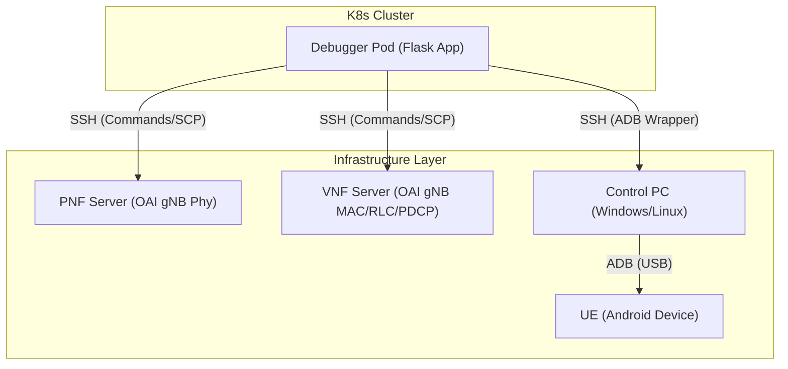

# System Architecture - Technical Reference

## Overview
The `ming-nfapi-debugger` is a distributed testing orchestration system designed for 5G OpenAirInterface (OAI) environments. It automates the process of deploying, testing, profiling, and analyzing 5G networks.

The system is built as a **Kubernetes Pod** (the "Debugger") that acts as the central controller. It communicates with external servers (PNF, VNF) and devices (Control PC/UE) to coordinate test scenarios.

## Component Diagram

## Detailed Workflow

### 1. The Entry Point: `main.py`
The `rapp/main.py` is a Flask web application that serves:
- **Web UI**: Dashboard for viewing results (`/`).
- **REST API**: Endpoints to trigger tests (`/trigger`), stop tests (`/api/stop`), and sync git (`/api/sync`).

When a test is triggered via `POST /trigger`:
1. `main.py` parses the request (duration, bandwidth, mode).
2. It calculates an estimated completion time (ETA).
3. It spawns a background thread running `run_test_task`.
4. This thread monkey-patches `sys.argv` and calls `auto_tester.main()`.

### 2. The Orchestrator: `auto_tester.py`
This script (`rapp/src/auto_tester.py`) is the brain of the operation. It executes the following lifecycle:

1. **Configuration Loading**: Reads `config.yaml`, `runtime.yaml`, and applies any runtime overrides.
2. **Environment Setup**:
   - Connects to PNF/VNF servers via SSH.
   - Stops any existing OAI processes (`stop_nfapi.sh`).
   - Starts the OAI components in the correct order (e.g., VNF first, then PNF).
3. **UE Control**:
   - Connects to the Control PC.
   - Toggles Airplane Mode (ON -> OFF) to force the UE to re-attach to the network.
4. **Traffic Generation**:
   - Starts `iperf3` server on the OAI/Infrastructure side.
   - Commands the UE (via ADB) to run `iperf3` client (DL/UL).
   - Runs `ping` tests.
5. **Profiling (Optional)**:
   - If enabled, runs `perf` on the PNF/VNF servers to capture CPU events.
   - Generates Flamegraphs.
6. **Data Collection**:
   - Fetches logs (local PNF/VNF logs, remote UE logs).
   - Fetches build artifacts.
7. **Analysis**:
   - Calls `unified_analyzer.py` to parse logs and generate CSVs/Plots.
8. **Storage & Sync**:
   - Moves data to `/app/experiment_data/raw_data` and `/app/experiment_data/figure`.
   - If Git Sync is enabled, pushes results to the remote repository.

### 3. The Analyzer: `unified_analyzer.py` & `runner.py`
The analysis engine correlates data using the following logic:

1. **Start Detection**: Identifies the global t0 (Start of Test) from environment logs or the first timestamp.
2. **Log Parsing**:
   - **iperf**: Extracts JSON timeseries for throughput.
   - **OAI Logs**: Regex-based parsing for MAC stats (UL/DL bytes, MCS) and PHY stats (HARQ feedback, CRC errors).
3. **Alignment**:
   - Converts relative timestamps from OAI logs to absolute Epoch time by aligning with the global t0.
4. **Plotting**:
   - Generates Matplotlib figures (Timeline, Boxplots, Heatmaps) in `rapp/src/analyzers/charts`.

## Data Flow

1. **Raw Log Generation**:
   - PNF/VNF generate logs in real-time.
   - UE generates iperf JSON output.
2. **Collection**: `auto_tester.py` uses SCP to gather all these files into a timestamped directory (e.g., `nfapi-MMDD-HHmm-suffix`).
3. **Processing**: `unified_analyzer.py` reads these raw text files and converts them into:
   - Time-series CSVs (Throughput, Latency, BLER).
   - Matplotlib Figures (`.png`).
4. **Presentation**: The Flask app serves the static files from `/app/experiment_data/figure` to the user.
