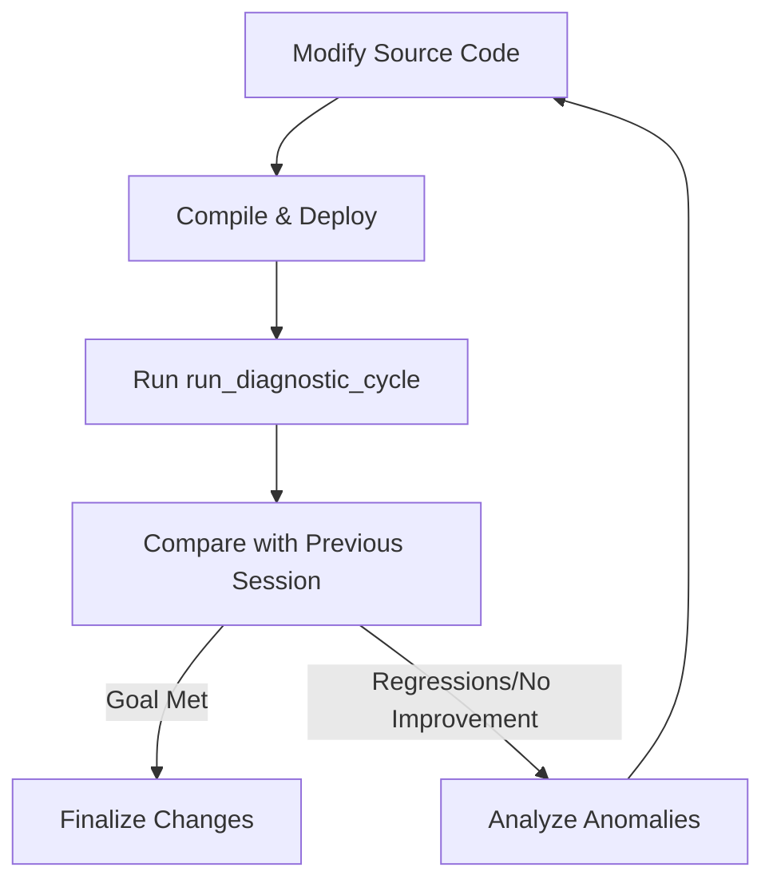

# Closed-Loop Development with MCP

This guide explains how to use the Radio Diagnostic MCP Server for automated, closed-loop development and verification.

## The Closed-Loop Flow

The most effective way to use this MCP server is to have the AI agent perform a "Modify -> Deploy -> Verify" cycle.



## Recommended Prompt Template

When you want the AI to optimize a specific metric (e.g., latency), use a structured prompt like this:

> [!TIP]
> Copy and paste this template into your AI assistant (Cursor, Claude, etc.) after making code changes.

```markdown
I have modified the source code to improve **[TARGET METRIC, e.g., latency]**. Please verify:

1. **Deploy**: Recompile and restart the server.
2. **Execute**: Use `run_diagnostic_cycle(duration=60, intent="verify improvement")`.
3. **Compare**: 
   - Check `list_sessions(limit=5)` for the baseline.
   - Compare current `[METRIC NAME]` from the tool's `overview` output with the previous session.
4. **Regressions**: Ensure `dl_bler_avg` and `negative_margin_count` have not increased.
5. **Decide**: If the goal is not met, use `get_summary_tables()` to analyze anomalies and iterate.
```

## Key Metrics for Success Criteria

| Metric | Target | Description |
|--------|--------|-------------|
| `latency_avg_ms` | < 10ms | Average end-to-end latency |
| `latency_p99_ms` | < 30ms | Tail latency (crucial for stability) |
| `dl_bler_avg` | < 0.1% | Ensure radio quality remains high |
| `negative_margin_count` | 0 | Ensure all processing deadlines are met |
| `throughput_avg_mbps` | > [Baseline] | Ensure no throughput regressions |

## Troubleshooting Iterations

If the AI fails to see improvement, direct it to:
1. **Analyze Intervals**: "Look at the `summary_intervals_*.csv` to see if the issue is specific to high-throughput bursts."
2. **Check Anomalies**: "Use `get_summary_tables` and list all anomalies with severity HIGH."
3. **Internal AI Insights**: "Read the `ai_analysis` field from the `run_diagnostic_cycle` output for root cause suggestions."
