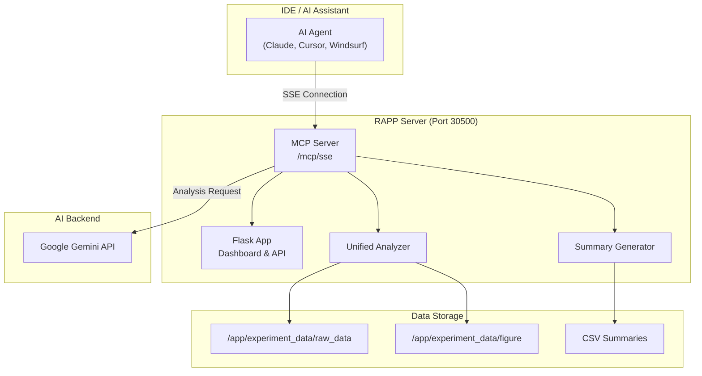

# MCP Server Guide

## What is MCP?

The **Model Context Protocol (MCP)** is an open standard that enables AI assistants to interact with external tools and data sources. This project implements an MCP Server that exposes the nfapi-debugger's testing and analysis capabilities to AI coding assistants.

With MCP integration, you can:
- Ask an AI agent to "Run a 30-second network diagnostic" and get AI-analyzed results
- Have your IDE AI analyze existing test data with specific focus areas
- Let AI coding assistants validate their algorithm changes against real network tests

## Architecture



## Available Tools

### `run_diagnostic_cycle`

Runs a full diagnostic cycle with AI-powered analysis.

> [!IMPORTANT]
> This is a **long-running operation**. The tool will NOT return until the full test cycle completes.
> **Estimated wait time**: `~(duration + 60)` seconds (test + startup overhead + analysis).

| Parameter | Type | Default | Description |
|-----------|------|---------|-------------|
| `duration` | int | 20 | Duration of traffic test in seconds |
| `config` | str | "default" | Configuration profile name |
| `intent` | str | null | Analysis focus (e.g., "check latency issues") |

**Mode**: Always uses `split` mode (enforced, cannot be overridden).

**Example:**
```
"Run a 60-second network diagnostic focusing on throughput stability"
```


---

### `analyze_existing_session`

Analyze an existing test session without running a new test.

| Parameter | Type | Default | Description |
|-----------|------|---------|-------------|
| `session_name` | str | null | Session name or partial match. If null, uses latest. |
| `intent` | str | null | Analysis focus |

**Example:**
```
"Analyze the session 'nfapi-0107-0800' and check for packet loss"
```

---

### `get_summary_tables`

Get LLM-optimized summary tables for efficient analysis.

| Parameter | Type | Default | Description |
|-----------|------|---------|-------------|
| `session_name` | str | null | Session name or partial match |

Returns compact CSV data suitable for AI analysis without processing large raw logs.

---

### `list_sessions`

List available test sessions.

| Parameter | Type | Default | Description |
|-----------|------|---------|-------------|
| `limit` | int | 10 | Maximum number of sessions to return |

---

## IDE Integration

### Prerequisites

1. **RAPP Server Running**: The RAPP server must be running and accessible
2. **Network Access**: Your IDE must be able to reach the RAPP server (default: port 30500)
3. **Google AI API Key** (optional): For AI-powered analysis, set `GOOGLE_AI_API_KEY`

### Claude Desktop (Connecting to Remote Server)

Since Claude Desktop connects via stdio, you need a local bridge script to forward traffic to the remote SSE endpoint.

1. **Install `mcp` package locally:**
   ```bash
   pip install mcp
   ```

2. **Create a Bridge Script (`mcp_bridge.py`):**

   ```python
   # mcp_bridge.py
   import asyncio
   import sys
   import json
   import httpx
   from mcp.server.stdio import stdio_server
   from mcp.types import JSONRPCMessage
   
   # Configuration
   SERVER_URL = "http://YOUR_SERVER_IP:30500/mcp/sse"
   CONNECT_TIMEOUT = 10.0
   
   async def main():
       try:
           # Use infinite read timeout for SSE stream
           timeout = httpx.Timeout(None, connect=CONNECT_TIMEOUT)
           
           async with httpx.AsyncClient(timeout=timeout) as client:
               async with client.stream("GET", SERVER_URL) as response:
                   if response.status_code != 200:
                       sys.stderr.write(f"Server returned status {response.status_code}\n")
                       sys.exit(1)
   
                   # extract endpoint from SSE events
                   endpoint_url = None
                   sse_lines = response.aiter_lines()
                   
                   async for line in sse_lines:
                       if not line: continue
                       if line.startswith("data: "):
                           path = line[6:].strip()
                           base_url = SERVER_URL.rsplit('/', 2)[0]
                           endpoint_url = base_url + path
                           break
                   
                   if not endpoint_url:
                       sys.stderr.write("Failed to discover endpoint\n")
                       sys.exit(1)
   
                   async with stdio_server() as (read_stdio, write_stdio):
                       
                       async def forward_to_server():
                           async for message in read_stdio:
                               try:
                                   # Unwrap SessionMessage if present (critical fix for mcp>=1.0)
                                   real_msg = message.message if hasattr(message, 'message') else message
                                   json_body = real_msg.model_dump_json() if hasattr(real_msg, 'model_dump_json') else str(real_msg)
                                   
                                   await client.post(endpoint_url, content=json_body, headers={"Content-Type": "application/json"})
                               except Exception as e:
                                   sys.stderr.write(f"Post error: {e}\n")
   
                       async def forward_from_server():
                           async for line in sse_lines:
                               if not line or not line.startswith("data: "): continue
                               try:
                                   data = json.loads(line[6:].strip())
                                   # Auto-repair missing jsonrpc version
                                   if isinstance(data, dict) and "jsonrpc" not in data:
                                       data["jsonrpc"] = "2.0"
                                   
                                   msg = JSONRPCMessage.validate_python(data)
                                   await write_stdio(msg)
                               except Exception:
                                   # Fallback to raw forwarding on validation error
                                   sys.stdout.write(line[6:].strip() + "\n")
                                   sys.stdout.flush()
   
                       await asyncio.gather(forward_to_server(), forward_from_server())
   
       except Exception as e:
           sys.stderr.write(f"Bridge error: {e}\n")
           sys.exit(1)
   
   if __name__ == "__main__":
       asyncio.run(main())
   ```

3. **Configure Claude Desktop:**

   Point the config to your python executable and the bridge script.

   ```json
   {
     "mcpServers": {
       "radio-diagnostic": {
         "command": "python3",
         "args": ["/absolute/path/to/mcp_bridge.py"]
       }
     }
   }
   ```

### Antigravity (Google Gemini CLI)

Antigravity is the AI coding agent built into Gemini CLI. Add to your MCP settings:

**Location**: `~/.gemini/settings.json` or project-level `.gemini/settings.json`

```json
{
  "mcpServers": {
    "radio-diagnostic": {
      "command": "python3",
      "args": [
        "/path/to/your/project/mcp_bridge.py"
      ]
    }
  }
}
```

> **Note:** To avoid system package conflicts, create a virtual environment:
> ```bash
> python3 -m venv venv
> source venv/bin/activate
> pip install mcp
> ```
> Then use the absolute path to `venv/bin/python3` in your configuration.

Alternatively, use direct SSE transport if supported:
```json
{
  "mcpServers": {
    "radio-diagnostic": {
      "transport": "sse",
      "url": "http://YOUR_SERVER_IP:30500/mcp/sse"
    }
  }
}
```

### Cursor IDE

Add to your Cursor settings (`.cursor/mcp.json` in your project or global settings):

```json
{
  "mcpServers": {
    "radio-diagnostic": {
      "transport": "sse",
      "url": "http://YOUR_SERVER_IP:30500/mcp/sse"
    }
  }
}
```

### Windsurf / Codeium

Add to Windsurf MCP configuration:

```json
{
  "mcpServers": {
    "radio-diagnostic": {
      "serverUrl": "http://YOUR_SERVER_IP:30500/mcp/sse",
      "transport": "sse"
    }
  }
}
```

### VS Code (Native MCP Support)

VS Code 1.99+ has native MCP support. Add to your VS Code settings (`settings.json`):

```json
{
  "mcp": {
    "servers": {
      "radio-diagnostic": {
        "type": "sse",
        "url": "http://YOUR_SERVER_IP:30500/mcp/sse"
      }
    }
  }
}
```

Or add to workspace `.vscode/mcp.json`:

```json
{
  "servers": {
    "radio-diagnostic": {
      "type": "sse",
      "url": "http://YOUR_SERVER_IP:30500/mcp/sse"
    }
  }
}
```

### VS Code with Continue Extension

Add to your Continue configuration (`~/.continue/config.json`):

```json
{
  "experimental": {
    "modelContextProtocolServers": [
      {
        "transport": {
          "type": "sse",
          "url": "http://YOUR_SERVER_IP:30500/mcp/sse"
        }
      }
    ]
  }
}
```

---

## Kubernetes Deployment Configuration

The MCP server is deployed as part of the RAPP container. Configuration is managed via Helm values.

### values.yaml Configuration

```yaml
# MCP Server nodePort (default: 30500)
service:
  mcpNodePort: 30500

# Google AI API Key for AI-powered analysis
rapp:
  google_ai_token: "YOUR_GOOGLE_AI_API_KEY"
```

The `google_ai_token` is automatically set as `GOOGLE_AI_API_KEY` environment variable in the container.

### Service Ports

| Port | NodePort | Description |
|------|----------|-------------|
| 5000 | 30002 | Flask API |
| 8000 | 30500 | MCP SSE Endpoint |
| 8501 | 30501 | Streamlit (if enabled) |

### Accessing MCP Endpoint

Once deployed, the MCP SSE endpoint is available at:
```
http://<KUBERNETES_NODE_IP>:30500/mcp/sse
```

### Generic MCP Client (Python)

```python
from mcp.client.sse import sse_client
import asyncio

async def main():
    async with sse_client("http://YOUR_SERVER_IP:30500/mcp/sse") as client:
        # List available tools
        tools = await client.list_tools()
        print("Available tools:", [t.name for t in tools.tools])
        
        # Run a diagnostic
        result = await client.call_tool(
            "analyze_existing_session",
            {"intent": "check for latency spikes"}
        )
        print(result)

asyncio.run(main())
```

---

## LLM-Optimized Summary Files

When analysis runs, the system generates compact CSV summaries in `<session>/csv_data/`:

| File | Description |
|------|-------------|
| `summary_overview_*.csv` | Single-row with key metrics (throughput, latency, BLER) |
| `summary_intervals_*.csv` | Per-traffic-interval breakdown |
| `summary_anomalies_*.csv` | Detected issues with severity levels |

These summaries are designed for LLM consumption, reducing token usage while preserving essential insights.

### Example Overview Summary

| Field | Value |
|-------|-------|
| `throughput_avg_mbps` | 485.2 |
| `latency_avg_ms` | 12.5 |
| `latency_p99_ms` | 45.3 |
| `dl_bler_avg` | 0.5% |
| `negative_margin_count` | 3 |

---

## AI Analysis with Intent

The `intent` parameter allows you to focus the AI analysis on specific areas:

| Intent Example | Focus |
|----------------|-------|
| `"check for packet loss"` | Analyzes BLER, retransmissions, throughput drops |
| `"investigate latency spikes"` | Focuses on ping patterns, margin violations |
| `"analyze throughput stability"` | Examines throughput variance, interval comparisons |
| `"check radio quality"` | BLER, CQI, MCS patterns |
| `"find timing issues"` | Margin analysis, deadline violations |

---

## Example Usage

### Ask Claude to Run a Test

```
"Run a 45-second network diagnostic test and tell me if there are any latency issues"
```

Claude will:
1. Call `run_diagnostic_cycle(duration=45, intent="check for latency issues")`
2. Wait for test completion
3. Receive AI analysis and metrics
4. Report findings in natural language

### Analyze Existing Data

```
"Look at the latest test results and check if throughput is stable across all bandwidth levels"
```

Claude will:
1. Call `list_sessions()` to find recent tests
2. Call `analyze_existing_session(intent="check throughput stability")`
3. Summarize findings

### Compare Algorithm Changes

```
"I just modified the scheduler algorithm. Run a test to see if latency improved compared to yesterday's results"
```

---

## Troubleshooting

### "MCP Server not available"

1. Check if RAPP is running: `curl http://YOUR_SERVER:30500/health`
2. Check MCP endpoint: `curl http://YOUR_SERVER:30500/mcp/info`
3. Verify `mcp` Python package is installed

### "AI analysis unavailable"

Set the Google AI API key:
```bash
export GOOGLE_AI_API_KEY="your_api_key_here"
```

### Connection Refused

1. Ensure RAPP server is running
2. Check firewall allows port 30500
3. Verify server IP is correct in client config

### No Sessions Found

Run at least one test via the dashboard or API first:
```bash
curl -X POST http://YOUR_SERVER:30500/trigger \
  -H "Content-Type: application/json" \
  -d '{"suffix": "test_run", "duration": 30}'
```

---

## API Reference

### Check MCP Status

```bash
curl http://YOUR_SERVER:30500/mcp/info
```

Response:
```json
{
  "mcp_available": true,
  "sse_endpoint": "http://YOUR_SERVER:30500/mcp/sse",
  "tools": [
    {"name": "run_diagnostic_cycle", "description": "..."},
    {"name": "analyze_existing_session", "description": "..."},
    {"name": "get_summary_tables", "description": "..."},
    {"name": "list_sessions", "description": "..."}
  ],
  "ai_enabled": true
}
```
